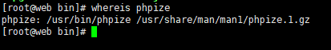
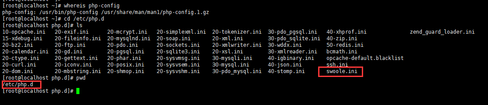
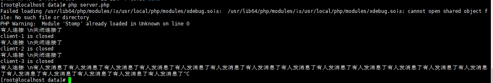
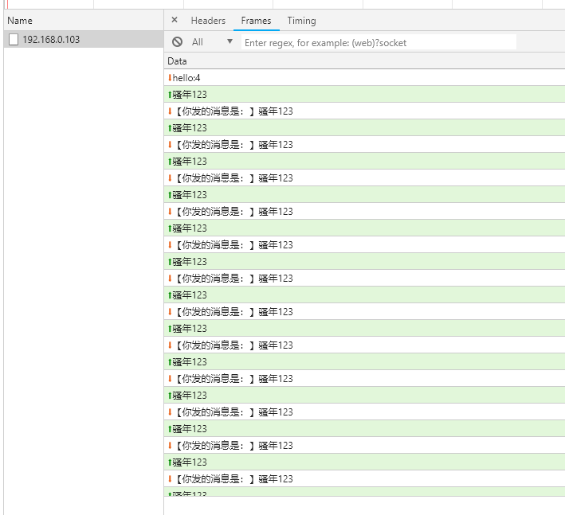

### php-swool扩展安装

liunx 上环境准备

**官方文档->**[swool官方文档](https://wiki.swoole.com/wiki/page/7.html)

- centos 版本是 7.2
- PHP版本 > 7.*
- gcc 版本 > 4.8 【swool官网要求的是最好大于4.8的版本，但我安装的时候我的版本是4.8.5。结果一直安装失败，所以我把gcc版本升级到6.1。swool安装成功
- make
- autoconf
- pcre 安装 `yum install pcre-devel`

`swool` 下载路径

[github下载地址](https://github.com/swoole/swoole-src/releases)

[php扩展路径](http://pecl.php.net/package/swoole)

[码云下载地址](http://git.oschina.net/swoole/swoole)

安装：

- swool 的扩展已经被编译到PHP扩展里，所以最简单的安装方式就是普通PHP扩展的安装方式 `yum install swoole`

- 编译安装

我选择的就是编译安装，【用yum安装报错，说我没有make，想不明白】

编译安装我们需要知道两个东西

`phpize`

`php-config`

先去查找它们的位置`whereis phpize | whereis php-config`



1. 进入我们已经下载好的swool安装包里 `cd swool`

2. 运行`phpize` => 我的 `/usr/bin/phpize`

3. 使用`php-config` => 我的 `./configure --with-php-config=/usr/bin/php-config` 【编译】

4. make

5. make install

第四部和第五步其实可以一起`make && make install`

6. 安装成功，输出`swoole.so`的安装路径

7. 找到我们PHP的扩展目录，我的是 `/etc/php.d`,添加swool.ini=>`extension=swoole.so`



8.重启nginx和php-fpm

`service nginx restart | service php-fpm restart`

9.查看`swoole`是否安装成功 `php -m`

以上属于最简单的安装，总体来说，对于我们新手来说，是够用了。在swool的文档中心，可以看到还可以运行它们写的脚本安装

```
mkdir -p ~/build && \
cd ~/build && \
rm -rf ./swoole-src && \
curl -o ./tmp/swoole.tar.gz https://github.com/swoole/swoole-src/archive/master.tar.gz -L && \
tar zxvf ./tmp/swoole.tar.gz && \
mv swoole-src* swoole-src && \
cd swoole-src && \
phpize && \
./configure \
--enable-coroutine \
--enable-openssl  \
--enable-http2  \
--enable-async-redis \
--enable-sockets \
--enable-mysqlnd && \
make clean && make && sudo make install
```

**注意**：Swoole的绝大部分功能只能用于cli命令行环境，请首先准备好Linux Shell环境

安装成功之后我们就迫不及待来测试一下吧

1.我们需要一个服务端

```php
//创建websocket服务器对象，监听0.0.0.0:9502端口
$ws = new swoole_websocket_server("0.0.0.0", 9502);

//监听WebSocket连接打开事件
$ws->on('open',function($fw,$request){
    echo '有人连接 \n';
    //var_dump($request);
    $fw->push($request->fd,'hello:'.$request->fd);
});
//监听WebSocket消息事件
$ws->on('message', function ($fw, $frame) {
    echo '有人发消息了';
    //var_dump($frame);
    $fw->push($frame->fd,'【你发的消息是：】'.$frame->data);
});

//监听WebSocket连接关闭事件
$ws->on('close', function ($ws, $fd) {
    echo "关闭连接了\n";
    echo "client-{$fd} is closed\n";
});

//开启服务
$ws->start();
```

客户端代码：

```html
<!DOCTYPE html>
<html lang="en">
<head>
    <meta charset="UTF-8">
    <title>Title</title>
</head>
<body>
<script>
    ws = new WebSocket('ws://192.168.0.103:9502');
    //var wsServer = 'ws://192.168.0.103:9502';
   // var websocket = new WebSocket(wsServer);
    ws.onopen = function (evt) {
        alert('打开连接！');
    };

    ws.onclose = function (evt) {
        alert('连接关闭');
    };

    ws.onmessage = function (evt) {
        ws.send('骚年123');
        alert('Retrieved data from server: ' + evt.data);
    };

    ws.onerror = function (evt, e) {
        alert('Error occured: ' + evt.data);
    };
</script>
</body>
</html>
```

我们在服务器上运行我们的`server.php`文件以后，在浏览器上打开我们的客户端`send.html`

服务端：



客户端：




