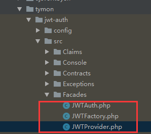

## **laravel使用jwt-token（五）**

首先在`config/app.php`文件的数组`'aliases' => [] `里添加两个类，这个就是在Facads容器里注册两个类
它们分别是：
```php
[
    'JWTAuth' => Tymon\JWTAuth\Facades\JWTAuth::class,
    'JWTFactory' => Tymon\JWTAuth\Facades\JWTFactory::class,
]
```
它们本来的位置是在
 

我们知道jwt-token,我们使用的这个版本既然是作为laravel的组件来使用，那么它就和laravel就是有紧密结合的,这里先不说哦
接下来还是我们的准备工作
看`config/auth.php`文件
```php
'defaults' => [
        'guard' => 'web',
        'passwords' => 'users',
    ],
    
'guards' => [
        'web' => [
            'driver' => 'session',
            'provider' => 'users',
        ],
    
        'api' => [
            'driver' => 'token',
            'provider' => 'users',
        ],
   ],
```
这里面有两个配置项**default** 和 **guards**  我们既然目标是做api验证，那么就要把defaults数组中`guard=>api`,数组`api=>['driver' => 'jwt']`。

- 这里我们创建登录所需要的控制器  ==》 `php artisna make:controller Api/UserController` 【记住，我们既然使用了，laravel，那么这些快捷的命令，一定要熟悉呢，原理也要去看】
我们这时就在这里创建了`App/Http/controllers/Api/UserController.php`这个文件。

- 创建几个测试路由
```php

Route::group(['namespace'=>'Api','prefix'=>'api'],function(){
   Route::post('login','UserController@login');//登录
   Route::post('logout','UserController@logout');//退出
   Route::post('refresh','UserController@refresh');//刷新
});
```
- 在`App/Http/controllers/Api/UserController.php`写几个方法,上面我们可以看到，我们创建的路由文件并没有给它加中间件，这个我们可以把它加在我们的这个文件的构造方法里
- 刚好说道中间件，在laravel里面创建中间件也是很方便的，这个命令一键生成`php artisna make:middleware apiLogin`
文件在`App/Http/Middleware/ApiLogin.php`
Apilogin这个中间件我们创建好了，那么如果我们想要这个中间件在我们的每个HTTP请求都进行的话，还需要将这个中间件放到`App/Http/Kerel.php`中注册
我们需要将我们定制的中间件放到
```php
 protected $routeMiddleware = [
        ...
        'apiLog' => \App\Http\Middleware\ApiLogin::class,
        ];
```
那么我们如果想要使用我们定制的中间件，那么我们只需要下面这样操作就OK了

```php
Route::group(['namespace'=>'Api','prefix'=>'api','middleware' => ['apiLog']],function(){
    //这个时候凡是在这个路由分组的请求，都会先经过 apiLog 这个中间件
})

//或者我们可以具体到路由
Route::group(['namespace'=>'Api','prefix'=>'api'],function(){
    //
    Route::post('login','UserController@login')->middleware('apiLog');
})

```
下面这种就是我们把中间件放到构造方法里，也是可以的
```php

    public function __construct()
    {
        $this->middleware('auth:api', ['except' => ['login']]);
    }

    public function login(Request $request)
    {

    }

    public function logout(Request $request)
    {

    }

    public function refresh(Request $request)
    {

    }
```
1.在 `login()`方法里，我们就是验证输入的用户，以及返回token，验证用户信息，我们放在中间件里
下面我们说生成token，生成token一共有三种方式
- 根据个人信息生成的
```php
$createToken =  $request->only(['user','email']);
$tiken = JWTAuth::attemt($createToken);
```
- 根据用户模型生成
```php

$createToken = User::find($request->id);
$token = JWTAuth::fromUser($createToken);
```
- 根据用户模型ID【用户数据表唯一标识】
```php
$token = auth()->tokenById($request->id);
```
2. 接下来说退出问题`logout()`
```php
 JWTAuth::invalidate($request->token);
```
3. 令牌刷新 `refresh()`
```php
JWTAuth::refresh();
```


