## 执行计划,这个里面我们会分析一下`mysql`的优化

ID相同，执行顺序从上到下
ID不同，如果是子查询，ID会递增，ID值越大优先级越高，ID大的先执行

select_type

system > const > eq_ref > ref > range > index > all

system 表只有一行记录

const 表示通过一次索引就找到了，const --> primary key |unique_index

eq_ref 唯一索引扫描，对于每个索引键

ref 非唯一索引扫描

range like > < 只检索给定范围的行，使用一个索引来选择行

index full index scan，索引全表扫描，把索引从头到位扫一遍

all full table scan 遍历全表以找到匹配的行


有可能用到的索引  possible_key

实际用到的索引 key

根据表统计信息或者索引选用情况，大致估算出 rows

filtered

Extra


************************************************************************************************************************

* 以`select *` 和具体的`select 字段`做比较,一下是查询到的总数据条数

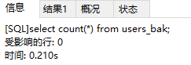

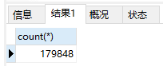

* a1.) 以`select *` 查询全部数据，没有建立索引，没有where条件，没有任何操作

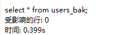

* a2.) 以具体字段的查询，后面没有任何条件,

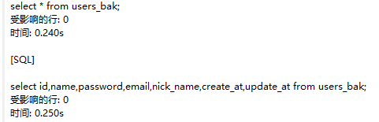

上面写*和把字段全部写出来，查询速度是差不多的。当然，在同一张表里的列如果很多的时候，指出你要需要的列是很有效果的。

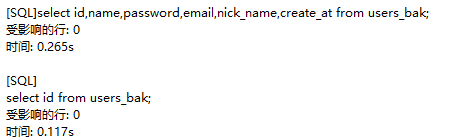

* b1.) SQL查询中`in`的值包含不要过多，而且能用`in`的不要用`or`,同时对于连续的`in`值，应当使用`between`[查询的ID是顺序的]

很明显，如果我们在查询的时候，查询的某一个字段的值是顺序的时候，最好是使用`between`


* b2.) SQL查询中，同一个字段的值不是顺序的，以`or` 和 `in`做对比

```mysql
select id,name,password,email,nick_name from users_bak where nick_name = '2IEyCY__0' or nick_name = 'm08pXM__3' or nick_name ='NrxYfR__6' or nick_name = '4aAwf8__11' or nick_name ='Q0nmEs__17' or nick_name ='VyOUIn__29' or nick_name='68Vzhe__2029' or nick_name='SqPRdZ__4024' or nick_name='SqPRdZ__4024' or nick_name ='Nh7IzL__17022';
select id,name,password,email,nick_name from users_bak where nick_name in ('2IEyCY__0','m08pXM__3','NrxYfR__6','4aAwf8__11','Q0nmEs__17','VyOUIn__29','68Vzhe__2029','SqPRdZ__4024','SqPRdZ__4024','Nh7IzL__17022');
```

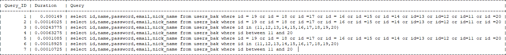

以上就是可以看出，在查询的字段的值没有一定的顺序的时候，明显使用`in`要比`or`快的多

* b3.) 加上时间字段的排序,没有建立索引，对`create_at`进行排序

```mysql
select id,name,password,email,nick_name from users_bak where nick_name = '2IEyCY__0' or nick_name = 'm08pXM__3' or nick_name ='NrxYfR__6' or nick_name = '4aAwf8__11' or nick_name ='Q0nmEs__17' or nick_name ='VyOUIn__29' or nick_name='68Vzhe__2029' or nick_name='SqPRdZ__4024' or nick_name='SqPRdZ__4024' or nick_name ='Nh7IzL__17022'  ORDER BY create_at desc;
select id,name,password,email,nick_name from users_bak where nick_name in ('2IEyCY__0','m08pXM__3','NrxYfR__6','4aAwf8__11','Q0nmEs__17','VyOUIn__29','68Vzhe__2029','SqPRdZ__4024','SqPRdZ__4024','Nh7IzL__17022') ORDER BY create_at desc;
```
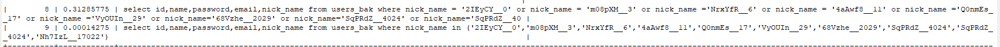

* b4.) 对`create_at`字段加上索引，再复现[b3]的查询

```mysql
-- 创建索引
create index users_bak_create_at_index on users_bak (create_at);

select id,name,password,email,nick_name,create_at from users_bak where nick_name = '2IEyCY__0' or nick_name = 'm08pXM__3' or nick_name ='NrxYfR__6' or nick_name = '4aAwf8__11' or nick_name ='Q0nmEs__17' or nick_name ='VyOUIn__29' or nick_name='68Vzhe__2029' or nick_name='SqPRdZ__4024' or nick_name='SqPRdZ__4024' or nick_name ='Nh7IzL__17022'  ORDER BY create_at desc;
select id,name,password,email,nick_name,create_at from users_bak where nick_name in ('2IEyCY__0','m08pXM__3','NrxYfR__6','4aAwf8__11','Q0nmEs__17','VyOUIn__29','68Vzhe__2029','SqPRdZ__4024','SqPRdZ__4024','Nh7IzL__17022') ORDER BY create_at desc;

```

在这里如果我们使用`explain` 分析SQL语句，发现我们虽然建立了索引，但是，我们的`where`条件后面字段，并没有使用索引字段。虽然后面的排序字段建立了索引
，它也不会使用索引。

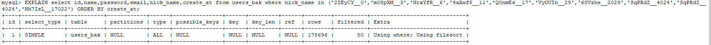

这里发现`type = all`,代表的就是遍历全表以找到匹配的行。下面看一个使用到索引的SQL

```mysql
EXPLAIN select id,name,password,email,nick_name,create_at from users_bak where create_at = 1553476748 ORDER BY create_at;
EXPLAIN select id,name,password,email,nick_name,create_at from users_bak where create_at > 1553476748 ORDER BY create_at;
EXPLAIN select id,name,password,email,nick_name,create_at from users_bak where create_at >= 1553476748 ORDER BY create_at;
EXPLAIN select id,name,password,email,nick_name,create_at from users_bak where create_at < 1553331240 ORDER BY create_at;
EXPLAIN select id,name,password,email,nick_name,create_at from users_bak where create_at <= 1553331240 ORDER BY create_at;
```

在这里，我们的`where`条件都有使用索引字段`create_at`。

* b4_a.) 第一个是等于,`type=ref`，表示使用非唯一索引扫描得到

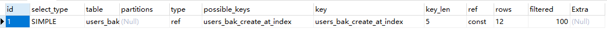

* b4_b.) 第二个到第五个是大于或小于以及大于等于，小于等于,`type=range`，表示使用like > < 只检索给定范围的行，使用一个索引来选择行，我们应该知道一
点，type的值那些，同时，这些值是一个怎样的排序，才能知道，我们的索引效果怎么样
`system > const > eq_ref > ref > range > index > all`在前面的表示索引效果更好

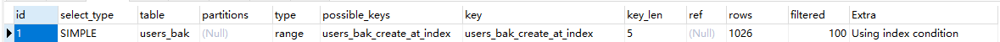

* b5.) 删除索引

```mysql
drop index users_bak_create_at_index on users_bak; 
```

* b6.) 创建一个联合索引，联合索引用到的字段是`name nick_name create_at`

```mysql
create index users_bak_name_nick_name_create_at_index on users_bak (name,nick_name,create_at);
```

**注意：** 联合索引是要符合最左匹配原则才走索引的，比如，我们查询中`where`后面的字段分别是：`name,nick_name,create_at`或者是`name,nick_name`
或者是`name`。那么此时，我们的索引肯定会走的。但是`where`后面分别是：
`create_at,nick_name`或者`nick_name,create_at`或者`nick_name`或者`create_at`,也就是联合索引字段不是创建联合索引的顺序，它就很笨不会走索引。

走索引：

```mysql
EXPLAIN select id,name,password,email,nick_name,create_at from users_bak where name = '1PsNur__3968';

EXPLAIN select id,name,password,email,nick_name,create_at from users_bak where email = 'yyLcFSFnM@163.com' and name = '1PsNur__3968';

EXPLAIN select id,name,password,email,nick_name,create_at from users_bak where name = '1PsNur__3968' and nick_name = 'zR9w0z__3980' and create_at = 1553476748;

EXPLAIN select id,name,password,email,nick_name,create_at from users_bak where email = 'yyLcFSFnM@163.com' and name = '1PsNur__3968';

EXPLAIN select id,name,password,email,nick_name,create_at from users_bak where create_at = 1553476748 and name = '1PsNur__3968' and nick_name = 'zR9w0z__3980';
EXPLAIN select id,name,password,email,nick_name,create_at from users_bak where nick_name = 'zR9w0z__3980' and create_at = 1553476748 and name = '1PsNur__3968';
EXPLAIN select id,name,password,email,nick_name,create_at from users_bak where nick_name = 'zR9w0z__3980'  and name = '1PsNur__3968' and create_at = 1553476748;

```
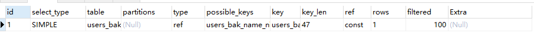


不走索引，`where` 条件里面的联合索引字段有`or`条件

```mysql
EXPLAIN select id,name,password,email,nick_name,create_at from users_bak where name = '1PsNur__3968' or email = 'yyLcFSFnM@163.com';
```
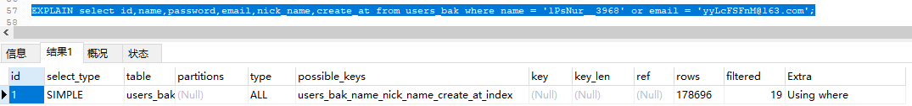

```mysql
EXPLAIN select id,name,password,email,nick_name,create_at from users_bak where name = '1PsNur__3968' or nick_name = 'zR9w0z__3980' or create_at = 1553476748;
```

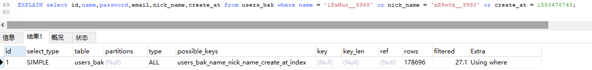

不符合最左匹配原则

```mysql
EXPLAIN select id,name,password,email,nick_name,create_at from users_bak where nick_name = 'zR9w0z__3980'  and create_at = 1553476748;
EXPLAIN select id,name,password,email,nick_name,create_at from users_bak where nick_name = 'zR9w0z__3980';
EXPLAIN select id,name,password,email,nick_name,create_at from users_bak where create_at = 1553476748;
```

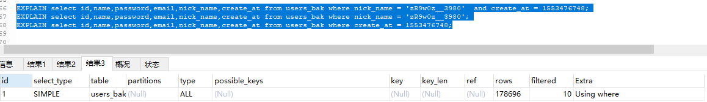

在联合索引中使用`between > <`都会使`MySQL`放弃走索引：

```mysql
EXPLAIN select id,name,password,email,nick_name,create_at from users_bak where `name` between 'abcdef' and 'QWERTY';
EXPLAIN select id,name,password,email,nick_name,create_at from users_bak where `name` between 'abcdef' and 'QWERTY' and create_at = 1553476748;
```

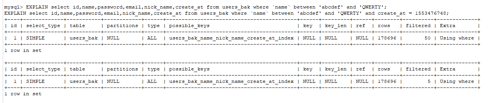


* c1.) 使用`limit 1`来测试走索引

```mysql
EXPLAIN select id,name,password,email,nick_name,create_at from users_bak order by id desc limit 1;
EXPLAIN select id,name,password,email,nick_name,create_at from users_bak order by name desc limit 1;
```

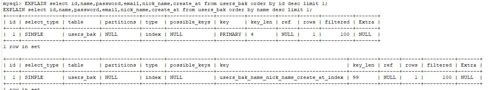

它们的`type = index`,这是在加了`limit 1` 的情况下，主键索引和联合索引都有索引在使用，那么在不加`limit 1`又是什么情况呢？

```mysql
EXPLAIN select id,name,password,email,nick_name,create_at from users_bak order by id desc;
EXPLAIN select id,name,password,email,nick_name,create_at from users_bak order by name desc;
```

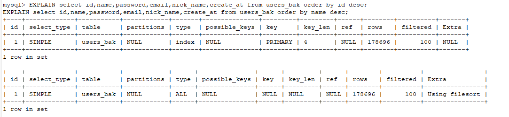

这下可以发现，主键索引在不加`limit 1`会继续走索引，而联合索引在不加`limit 1`的时候，就是走全表扫描，不会走联合索引。所以：**在有联合索引的情况下
，我们只拿一条排序后的记录，使用`limit 1`，是会走联合索引的**

删除联合索引：

```mysql
drop index users_bak_name_nick_name_create_at_index on users_bak;
```


* d1.) 对排序字段尽量创建索引，如果一个字段是最容易被当做排序字段，那一定要走索引，不然效率差距很大，比如：`create_at`创建索引，`update_at`不创
建索引，对他们做同样的操作

```mysql
create index users_bak_create_at_index on users_bak(create_at);

 EXPLAIN select id,name,password,email,nick_name,create_at from users_bak where create_at in(1553331295,1553333835,1553331296,1553331299,1553331310,1553331520,1553331333) order by create_at desc;
 EXPLAIN select id,name,password,email,nick_name,create_at from users_bak where update_at in(1553331295,1553333835,1553331296,1553331299,1553331310,1553331520,1553331333) order by update_at desc;

select id,name,password,email,update_at,create_at from users_bak where create_at in(1553331295,1553333835,1553331296,1553331299,1553331310,1553331520,1553331333) order by create_at desc;
select id,name,password,email,update_at,create_at from users_bak where update_at in(1553331295,1553333835,1553331296,1553331299,1553331310,1553331520,1553331333) order by update_at desc;

```

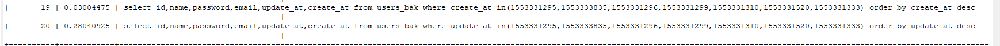


* e1.) 使用 `union all` 代替 `union`

```mysql
select id,name,password,email,nick_name,create_at from users_bak union select id,name,password,email,age,create_at from users limit 100;

select id,name,password,email,nick_name,create_at from users_bak union all select id,name,password,email,age,create_at from users limit 100;
```


注意：`union` 和 `union all` 的最大区别就是，`union`会做合并，需要将结果集合并后再进行唯一性过滤操作，这就会涉及到排序，增加大量的CPU运算，加大资源消耗及延迟，`union all`是全部展示，不做额外的开销


* f1.) 模糊查询不走索引之`%like%`,通俗的说就是`%`号在前，的会导致索引失效

```mysql
-- 创建索引 
create index users_bak_name_index on users_bak(name); 

EXPLAIN select id,name,password,email,nick_name,create_at from users_bak where `name` like "%KspIN";
EXPLAIN select id,name,password,email,nick_name,create_at from users_bak where `name` like "UKspI%";
```

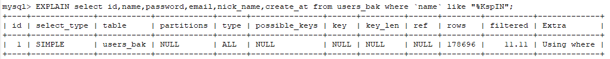

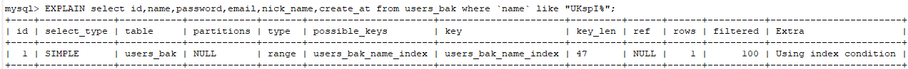


* g1.) 避免在索引字段做不经意间的隐式转换，创建时间字段是`int`类型，查询时我们输入字符串,有的资料说做隐式转换会使索引失效，这次我也来做了实验，第一
个是`create_at`字段，第二个是`name`字段，两个字段都建立了普通索引`index`,第一个隐式转换是字符串转为整型，第二个是整型转为字符串类型，结果显示字
符串转为整型的，索引没有影响，第二个整型转为字符串的有影响，没有走索引
SQL字段类型：

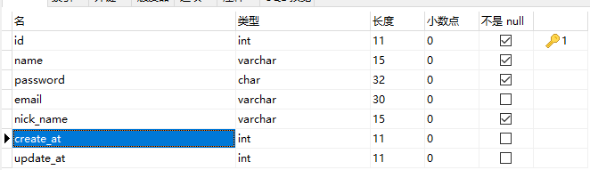

```mysql
EXPLAIN select id,name,password,email,nick_name,create_at from users_bak where create_at ='1553331295';
EXPLAIN select id,name,password,email,nick_name,create_at from users_bak where create_at =1553331295;

EXPLAIN select id,name,password,email,nick_name,create_at from users_bak where name ='123456';
EXPLAIN select id,name,password,email,nick_name,create_at from users_bak where name =123456;

```

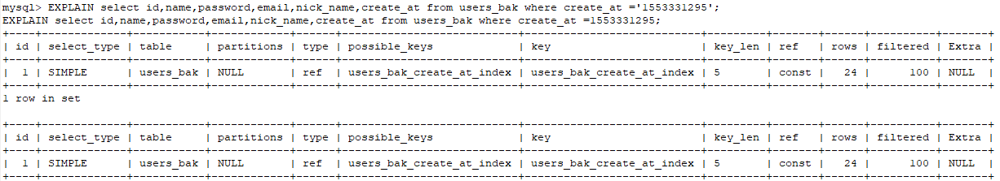

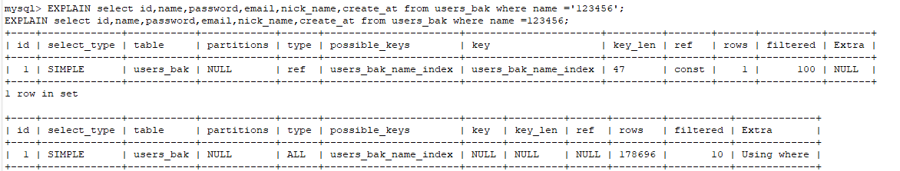

* h1) 避免在`where`字句中做表达式操作,有索引字段`create_at`，在子句中表达式操作，索引会失效。但是对字段进行操作就没有影响了

```mysql
EXPLAIN select id,name,password,email,nick_name,create_at from users_bak where create_at+1 =1553331296;
EXPLAIN select id,name,password,email,nick_name,create_at from users_bak where create_at =1553331296-1;
```

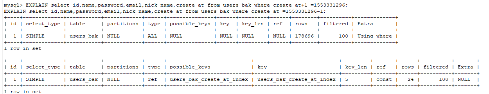

************************************************************************************************************************

SQL优化还有很多的值得学习的地方，加油！这是我github上个人学习笔记，大家多多交流


