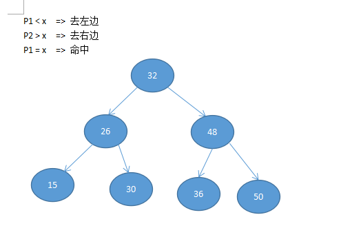
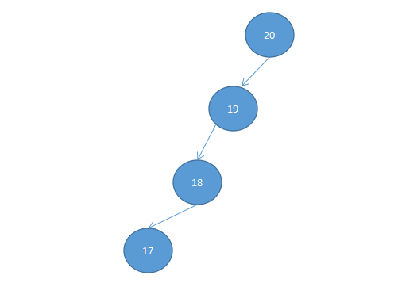
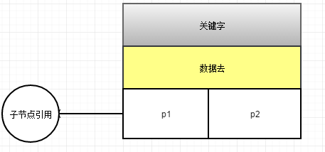
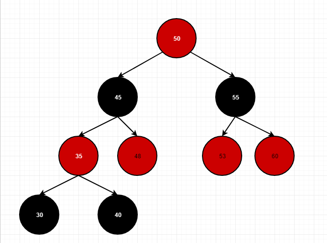

### mysql的索引推理学习

**正确的创建合适的索引，是提升数据库查询的基础**

- 什么是索引
索引是为了加速对表中数据行的检索而创建的一种分散存储的 **数据结构**
工作机制 【索引=》表数据】

- 数据结构

二叉查找树又叫二叉排序树
1.    【若左子树不空，则左子树上所有结点的值均小于它的根结点的值】
2.    【若右子树不空，则右子树上所有结点的值均大于它的根结点的值】
3.    【左、右子树也分别为二叉排序树】
4.    【没有键值相等的节点】
步骤：若根节点的关键字值等于查找的关键字，成功。否则，若小于根结点的关键字的值，递归查找左子树。若大于根结点的关键字值，递归查找右子树。若子树为空，这查找失败

**注意：**当我们插入序列时有序的时候，我们的二叉查找树又会退化成为链表

平衡二叉查找树：
> 平衡二叉搜索树（Self-balancing binary search tree）又被称为AVL树（有别于AVL算法），且具有以下性质：它是一 棵空树或它的左右两个子树的高度差的绝对值不超过1，并且左右两个子树都是一棵平衡二叉树。平衡二叉树的常用实现方法有红黑树、AVL、替罪羊树、Treap、伸展树等。 最小二叉平衡树的节点总数的公式如下 F(n)=F(n-1)+F(n-2)+1 这个类似于一个递归的数列，可以参考Fibonacci(斐波那契)数列，1是根节点，F(n-1)是左子树的节点数量，F(n-2)是右子树的节点数量

    它的节点存储包括三部份：
        1.关键字 【作为数据的对比】
        2.数据区【可能数据直接存储在里面或者存储的是数据区的引用】
        3.子节点引用

节点存储：

红黑树：

红黑树可以保证树的平衡

**注意：**树的查找性能取决于树的高度，而让树尽可能的平衡，就是为了降低树的高度

二叉树的缺陷：
        1.搜索效率不足
        一般来说，在树结构中数据处的深度决定它的搜索时的io
        2.节点数据内容太少
        每一个磁盘块（节点/页）保存节点关键字数据量太小
        没有很好的利用操作系统和磁盘的数据交换特性【4kb】，也没有利用好磁盘io的预读能力（空间局部性原理）

多路平衡查找树【绝对平衡】
路 =》 节点的分支个数
关键字 =》 路 - 1

- mysql 的引擎主要是`innodb` 和 `myisam`

- mysql 是基于
