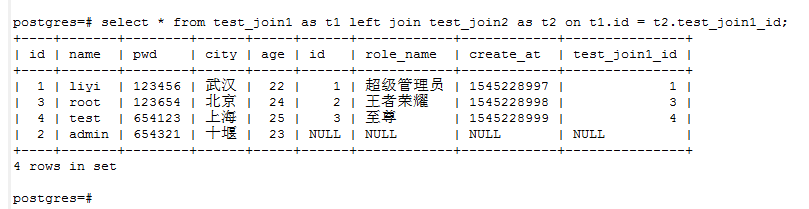
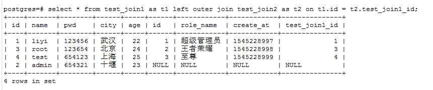
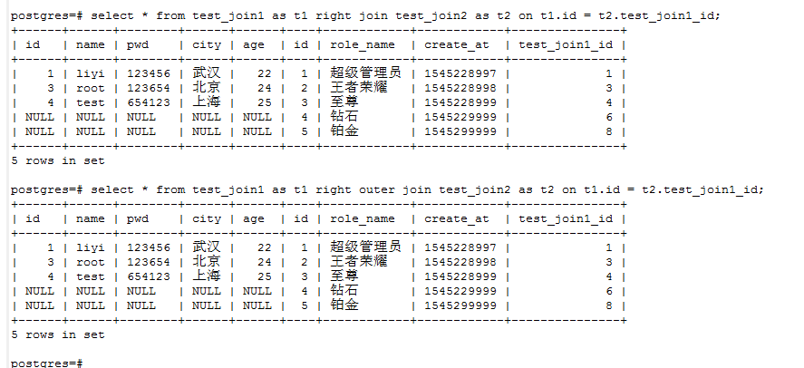
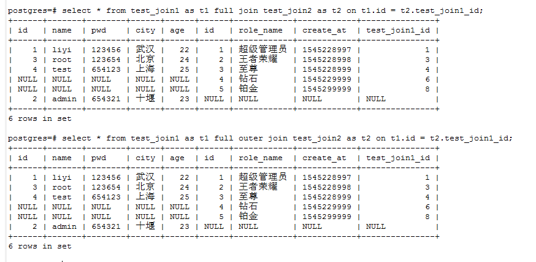
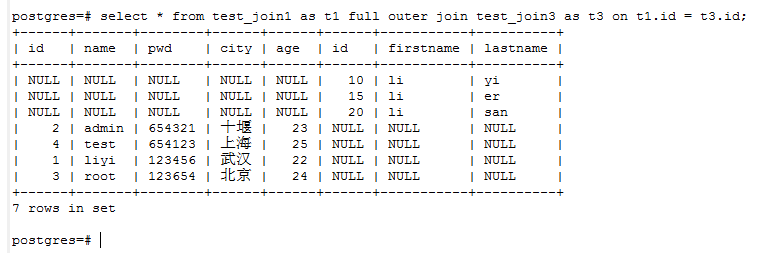
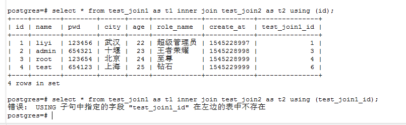
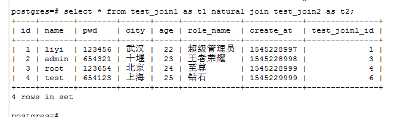

### psql初识（四） -- select[join]

我们在昨天学习了`from`子句后面的`cross join`和`inner join`语句
现在先来复习一下
- `cross`

```postgresql
select * from test_join1 cross join test_join2;

select * from test_join1 as t1 inner join test_join2 as t2 on t1.id = t2.test_join1_id;

select * from test_join3 cross join test_join1 as t1 inner join test_join2 as t2 on t2.test_join1_id = t1.id;
```
- 左连接 `left join`

> 对于 T1 的每一行 R1，生成的连接表都有一行对应 T2 中的每一个满足和 R1 的连接条件的行。

```postgresql
select * from test_join1 as t1 left join test_join2 as t2 on t1.id = t2.test_join1_id;
```

由上图我们可以看出：左连接就是以左边的表为主，左边有多少行，右边就是不匹配也会显示为null。放在我们这里来说就是join1边为主，join2表符合条件的显示【on后面条件】出来，不符合条件的不显示。然后右边以null填充。

- 左连接 `left outer join`

> 首先，执行一次内连接。然后，为 T1 中每一个无法在连接条件上匹配 T2 里任何一行的行返回一个连接行，该连接行中 T2 的列用空值补齐。因此，生成的连接表里为来自 T1 的每一行都至少包含一行。

```postgresql
select * from test_join1 as t1 left outer join test_join2 as t2 on t1.id = t2.test_join1_id;
```



从结果上看，我们觉得没有什么差别，`left join` 和 `left outer join`.**差别目前不知道**

- 右连接 `right join`

```postgresql
select * from test_join1 as t1 right join test_join2 as t2 on t1.id = t2.test_join1_id;
```

- 右连接 `right outer join `

```postgresql
select * from test_join1 as t1 right outer join test_join2 as t2 on t1.id = t2.test_join1_id;
```

结果如下：



从上面我们可以看到右连接和左连接是刚好相反的。其实很好理解嘛，左的对立面就是右嘛
> 首先，执行一次内连接。然后，为 T2 中每一个无法在连接条件上匹配 T1 里任何一行的行返回一个连接行，该连接行中 T1 的列用空值补齐。因此，生成的连接表里为来自 T2 的每一行都至少包含一行。

- FULL OUTER JOIN

> 首先，执行一次内连接。然后，为 T1 中每一个无法在连接条件上匹配 T2 里任何一行的行返回一个连接行，该连接行中 T2 的列用空值补齐。同样，为 T2 中每一个无法在连接条件上匹配 T1 里任何一行的行返回一个连接行，该连接行中 T1 的列用空值补齐

这一个我们用过，上面是社区文档的介绍

```postgresql
select * from test_join1 as t1 full join test_join2 as t2 on t1.id = t2.test_join1_id;

select * from test_join1 as t1 full outer join test_join2 as t2 on t1.id = t2.test_join1_id;
```
如图所示：



其实看图我们就知道了，它就是把我们两张表先做内链接，这是可以匹配的，然后以我们的条件，两张表都有的数据做条件，我有的你是null填充，你有的我用null填充。
下面我们做一个都不匹配的试试，

```postgresql
select * from test_join1 as t1 full outer join test_join3 as t3 on t1.id = t3.id;
```
如图：




- `using`

> 是个缩写符号，它允许你利用特殊的情况：连接的两端都具有相同的连接列名。它接受共享列名的一个逗号分隔列表，并且为其中每一个共享列构造一个包含等值比较的连接条件。例如用USING (a, b)连接T1和T2会产生连接条件ON T1.a = T2.a AND T1.b = T2.b。

```postgresql
select * from test_join1 as t1 inner join test_join2 as t2 using (id);

select * from test_join1 as t1 inner join test_join2 as t2 using (test_join1_id);
```

我们使用`using (condition)`时候，这个条件必须是两张表都有的字段，不然是会报错的。

如图：



- JOIN USING
>更进一步，JOIN USING的输出会废除冗余列：不需要把匹配上的列都打印出来，因为它们必须具有相等的值。不过JOIN ON会先产生来自T1的所有列，后面跟上所有来自T2的列；而JOIN USING会先为列出的每一个列对产生一个输出列，然后先跟上来自T1的剩余列，最后跟上来自T2的剩余列。

- NATURAL | NATURAL JOIN
>NATURAL是USING的缩写形式：它形成一个USING列表， 该列表由那些在两个表里都出现了的列名组成。和USING一样，这些列只在输出表里出现一次。 如果不存在公共列，NATURAL JOIN的行为将和 JOIN ... ON TRUE一样，产生交叉连接。

```postgresql
select * from test_join1 as t1 natural join test_join2 as t2;
```

如图所示：



----

越是学习，越是知道自己的渺小，心存敬畏。更加努力！！！
