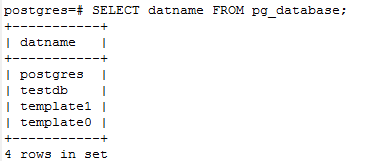

### 初识pgsql(一)
- psql在安装完成之后，我们就需要登录到psql.
下面是操作
```postgresql
-- 进入到psql的\bin目录下,输入：
psql -h 127.0.0.1 -d testsql -U root

```

- 在windows上操作数据库，新安装的数据库默认用户是：**postgres**
```postgresql
/*登陆就是进到psql安装的bin目录下，然后输入psql postgres,回车，输入密码*/
psql postgres;

/*首次进来我们是超级用户，这是很危险地行为，所以我们需要为我们自己创建用户*/
CREATE USER liyi WITH PASSWORD '123456';

/*查看我们是否创建用户成功*/
\du;
/*或者*/
SELECT ROLNAME FROM PG_ROLES;

/*创建我们的测试数据库,创建testdb数据库，所有者为liyi,我们刚创建的用户*/
CREATE DATABASE testdb OWNER liyi;

/*查看是否创建数据库成功*/
\l;
/*或者*/
SELECT DATNAME FROM PG_DATABSE;

/*给我们刚刚创建的数据库赋予权限*/
GRANT ALL PRIVILEGES ON DATABASE testdb TO liyi;
```
效果如下：





- 创建一个数据库

```sql
-- 创建一个新的数据库
createdb test;
```
> 详情点击 [创建数据库](http://www.postgres.cn/docs/10/app-createdb.html)

- 删除数据库
```postgresql
-- 删除数据库

dropdb test
```
> 详情点击 [删除数据库](http://www.postgres.cn/docs/10/app-dropdb.html)

- 访问数据库
```postgresql
psql test;
```
进入以后可能看到的是：
```postgresql
test=>
test=#
```

- 获取pgsql帮助语法
```postgresql
test=>\
```

- 退出psql
```postgresql
test=\q
```
- 创建数据库表
```postgresql
create table users(
name varchar(20),
city varchar(80),
age int,
create_time date
);
```
- pgsql 的数据类型
```postgresql

```

- 删除表
```postgresql
drop table users;
```

- 插入语句
```postgresql
insert into users (name,city,age) value('liyi','武汉',24,'2018-12-17');

-- 插入坐标点
create table location();
city varchar(20),
lon_lat point
insert into location (city,lon_lat) value('武汉','(33.125,144.256)');
```

- **copy** 命令
> COPY在 PostgreSQL表和标准文件系统文件之间 移动数据。COPY TO把一个表的内容复制 到一个文件，而COPY FROM 则从一个文件复制数据到一个表（把数据追加到表中原有数 据）。COPY TO也能复制一个 SELECT查询的结果。
[copy 命令详解](http://www.postgres.cn/docs/10/sql-copy.html)
```postgresql
-- copy to
copy users (name,age,city,create_time) from '/data/server/users.txt';
-- copy from

```

- 查询命令
```postgresql
-- 查询全部
select * from users;

-- 查询指定的列
select name,age from users;

-- 带指定的条件
select age from users where age >= 20;

-- 给指定的列起别名
select name as 名字,age as 年龄，city as 城市 from users;
```

- 更新命令
```postgresql
update users set city = '十堰' where 'name' = 'admin';
```
