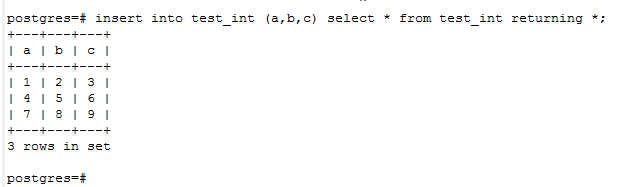

### 初识psql(三)--查询 SELECT
我们一般的查询语句语法就是：

```postgresql
SELECT select_list FROM table ['where','order by','group by','...'];
```
在表名的后面可以根据自己的条件结合很多。

1.1 我们可以结和我们第二节学习，创建了`users`表，今天我们来查询`users`表：

```postgresql
select * from users;
```
下面是得到的结果：


1.2 其实`select`的后面也可以结合很多，比如我们1.1就是直接`*`,就是代表我们将要查询表里所有的字段做显示。这只是我们在做测试的时候喜欢用`*`,在我们做开发的时候，我们一般不会这么做，我们需要那个字段就直接写出那个字段。在这里我们再次开锁`select`后面更多的技能。一个选择列表也可以选择可用列的一个子集或者在使用它们之前对列进行计算。例如，如果table1有叫做a、b和c的列（可能还有其他），那么你可以用下面的查询：

```postgresql
/*首先可以计算的，结算结果精确的，肯定是同类型的数字数据类型最好了，我们可以创建一个tset_int表*/
drop table if exists test_int;
create table if not exists test_int(
    a int,
    b int,
    c int
    );
-- 插入三条数据
insert into test_int values (1,2,3),(4,5,6),(7,8,9);

-- 查询数据
select a,a+b,b+c from test_int;

-- 我们还可以把查询的数据插入到表里，还记得我们第二节学习的吗
insert into test_int (a,b,c) select * from test_int returning *;
```
结果如下：





上面的结果虽然是好的，但是我们看到第二列和第三列的字段名是显示不出来的，所以我们可以稍作改变，那就是我们可以给它字段起别名，那么看接下来的：

```postgresql
select a,a+b as a_b,b+c as b_c from test_int;
```
结果如下：


没有被起别名的在上面，字段显示不出来；起了别名的在下面字段名显示出来了

1.3 我们还可以让`select`当我们的计算器使用哦，就像下面这样：

```postgresql
select 3+4;
select 3*4;
select 4-3;
select 4/4;
select 4%3;
```
结果如下：


**【需要注意的就是：最好不要用它做除法运算，看看上面除法的运算结果就知道了哦】**

1.4  select 还可以调用函数，我们来试一下呢：

```postgresql
select random();
```
结果如下：


1.5 这里我们就要进入稍微复杂一点的`FROM`字句的练习了，我们首先来学习的就是`jion`连接，这是我们在做开发的时候很好用的一种查询，你学会它了，就会是你的一大助力哦。

先决条件，既然是联合查询，那么我们就要先有表，而且是两张之间有关系的表，哎！是不是剪不断，理还乱呀。没事，我们慢慢的理就可以了，下面我们先创建两张表

```postgresql
drop table if exists test_join1;
create table if not exists test_join1(
id serial primary key,
name varchar(30),
pwd varchar(32),
city varchar(30),
age int
    );
insert into test_join1 (name,pwd,city,age) values ('liyi','123456','武汉',22),('admin','654321','十堰',23),('root','123654','北京',24),('test','654123','上海',25);

drop table if exists test_join2;
create table if not exists test_join2(
id serial primary key,
role_name varchar(10),
create_at int,
test_join1_id int
    );
insert into test_join2 (role_name,create_at,test_join1_id)values ('超级管理员',1545228997,1),('王者荣耀',1545228998,3),('至尊',1545228999,4),('钻石',1545229999,6),('铂金',1545299999,8);
```
- 交叉连接`table1 cross join table2`

```postgres
select * from test_join1 cross join test_join2;
```
> 对来自于T1和T2的行的每一种可能的组合（即笛卡尔积），连接表将包含这样一行：它由所有T1里面的列后面跟着所有T2里面的列构成。如果两个表分别有 N 和 M 行，连接表将有 N * M 行。

[from 子句 连接 点击](http://www.postgres.cn/docs/10/queries-table-expressions.html)

得到的查询结果：


【`cross`查询的时候就是把两张表的结果所有的可能全部罗列出来，比如一个4条记录，一个5条记录，最后的结果就是20条记录】

- 内连接`inner join`

```postgres
select * from test_join1 as test1 inner join test_join2 as test2 on test1.id = test2.test_join1_id;
```
结果如下：


**注意：**
> 当多于两个表出现时，后一种等效并不严格成立，因为JOIN比逗号绑得更紧。例如FROM T1 CROSS JOIN T2 INNER JOIN T3 ON condition和FROM T1,T2 INNER JOIN T3 ON condition并不完全相同，因为第一种情况中的condition可以引用T1，但在第二种情况中却不行。

现在我们来实现一下：

```postgres
-- 创建第三张表test_join3

drop table if exists test_join3;

create table if not exists test_join3(
id serial primary key,
firstname text,
lastname text
);

insert into test_join3 (firstname,lastname) values ('li','yi'),('li','er'),('li','san');
```

首先我们操作的是 `table1 aross join table2 inner join table3 on`

```postgres
select * from test_join3 cross join test_join1 inner join test_join2 on test_join2.test_join1_id = test_join1.id;
```

返回的结果如下：


第二种的操作是：`table1,table2 inner jion table3 on`

```postgres
-- 1.
select * from test_join1,test_join3;
-- 2.
select * from test_join1 cross join test_join3;

-- 1和2的返回结果是相同的，那么我们为什么不能和 第一种情况一样在on后面引用test_join1呢，我们先试一下看看会不会报错
select * from test_join1,test_join2 inner join test_join3 on test_join2.test_join1_id = test_join1.id;
/*
错误:  对于表 "test_join1"的FROM子句项的引用无效
LINE 1: ...ner join test_join3 on test_join2.test_join1_id = test_join1...
                                                             ^
HINT:  这里有一个对于表"test_join1"的项，但是不能从查询的这个部分中引用.
 */

```
我们先看一下报错信息：


