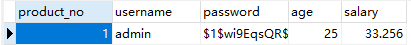
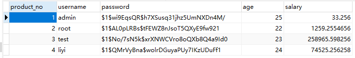
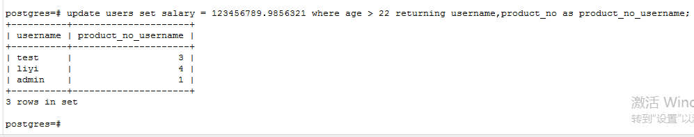

### 初识psql(二)

在第一初识psql里面我们学习了怎么登陆psql,以及我们怎么创建用户，怎么创建数据库，还有一些简单的查询，这些基本就和我们学习mysql没有区别的。这一节里我们将要继续深入学习具体的psql.

- **(一).<a src="1">插入数据</a>**
- **(二).<a src="2">更新数据</a>**
- **(三).<a src="3">删除数据</a>**
- **(四).<a src="4">从修改的行中返回数据</a>**

1.1 创建数据表，`users`
```postgresql
/*创建数据表之前，先删除表如果存在，*/
drop table if exists users;

/*创建数据表如果不存在*/
create table if not exists users(
product_no integer,
username varchar(30) unique not null,
password varchar(128) not null,
age int,
salary numeric
);
```
如图所示：


1.2 现在我们向users表插入数据试一试
```postgresql
insert into users (product_no,userbane,password,age,salary) values (1,'admin','$1$wi9EqsQR$h7XSusq31jhz5UmNXDn4M/',25,33.256);
/*这里所用的php单项加密函数crypt()*/
```
运行如下：


数据表如下：


1.3 现在我们尝试一次插入多条语句试试
```postgresql
insert into users (product_no,username,password,age,salary) values
(2,'root','$1$AL0pLRBs$tFEWZ8nJsoT5QXyE9fw921',22,1259.2554656),
(3,'test','$1$No/7sN5k$xrXNWCVro8oQXb8Q4a9Id0',23,258965.598256),
(4,'liyi','$1$QMrVyBna$wolrDGuyaPUy7IKzUDuFf1',24,74525.256258);
```
运行如下：


数据表如下：


1.4 插入查询的结果
```postgresql
insert into users (product_no,username,password,age,salary) select * from users_tset where age > 23;

/*说明：这里查询的users_tset表就是我直接拿上面users表运行的，数据呢也是上面的插入数据，太懒了，所以--想要自己锻炼一下的可以重新写哦。如果不想重写的记得把建表时users->username的唯一约束unique去掉，不然是插入不成功的。*/
```
运行如下：


数据表如下：


2.1 更新我们users表是数据，我们把年龄大于23岁的工资统一加薪
```postgresql
update users set salary = 25698536.25698 where age > 23;
```
运行如下：


数据表如下：


2.2 <a src="#">当然，我们也可以做多个where条件限制，以及同时更新多个字段</a>
```postgresql
update users set salary = 60000000.25698,age=30 where product_no = 1;
```
效果图就不放了，结果肯定是没问题的；

3.1 删除数据表里的我们不想要的数据
```postgresql
-- delete from [table] where [字段] 条件

delete from users where age = 25;
```
运行如下：


数据表如下：


4.1 [从修改的行中返回数据](http://www.postgres.cn/docs/10/dml-returning.html)
> 有时在修改行的操作过程中获取数据很有用。INSERT、 UPDATE和DELETE命令都有一个支持这个的可选的 RETURNING子句。使用RETURNING 可以避免执行额外的数据库查询来收集数据，并且在否则难以可靠地识别修改的行时尤其有用。
>所允许的RETURNING子句的内容与SELECT命令的输出列表相同 （请参阅第 7.3 节）。它可以包含命令的目标表的列名， 或者包含使用这些列的值表达式。一个常见的简写是RETURNING *， 它按顺序选择目标表的所有列。
>在INSERT中，可用于RETURNING的数据是插入的行。 这在琐碎的插入中并不是很有用，因为它只会重复客户端提供的数据。 但依赖于计算出的默认值时可以非常方便。例如，当使用 serial列来提供唯一标识符时， RETURNING可以返回分配给新行的ID：

- 4.2 returning 新增

```postgres
-- 创建测试表test 主键自增
create table if not exists tests (
firstname text,
lastname text,
id serial primary key
);
-- 插入一条记录，并且使用RETURNING返回新创建的id
insert into tests (firstname,lastname) values ('admin','root') returning id;
```
运行如下：


数据表如下：


运行如下：


数据表如下：


- 4.3 returning 更新
```postgres
update users set salary = 123456789.9856321 where age > 22 returning username,product_no as product_no_username;
```
运行如下：


数据表如下：


- 4.4 returning 删除
```postgres
delete from users_tset where age > 22 returning *;
```
删除数据表数据returning运行


