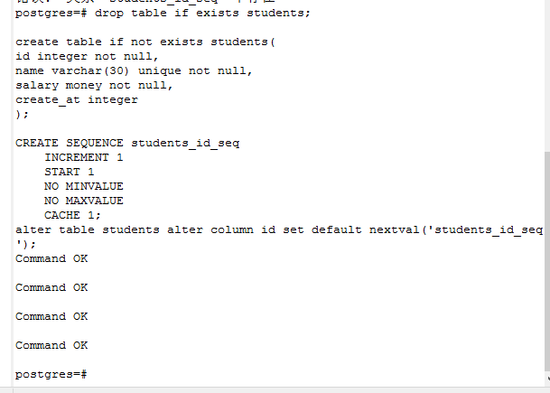
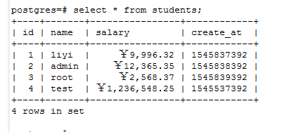
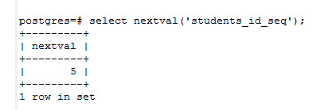

### 初识psql (五) 之 where 字句

**`where`子句的语法：**

```postgresql
where search_condition
```

从定义上看我们知道，where后面跟的是一个条件搜索语句，即它的最后得到的返回值是布尔类型，`boolean` 只有两种可能`true`或`false`,就是这个条件搜索语句执行之后，`true`就返回我们前面`select`后面的列；`false` 就是没有得到我们想要的数据

我们还是先定义一张表`student`

```postgresql
drop table if exists students;

create table if not exists students(
id integer not null,
name varchar(30) unique not null,
salary money not null,
create_at integer  
);

//创建自增主键
CREATE SEQUENCE students_id_seq
    INCREMENT 1
    START 1
    NO MINVALUE
    NO MAXVALUE
    CACHE 1;
alter table students alter column id set default nextval('students_id_seq');

insert into students (name,saraly,create_at) values ('liyi',9996.32,1545837392),
('admin',12365.35,1545838392),
('root',2568.365,1545839392),
('test',1236548.25,1545537392);
```




**注意=>psql主键的创建语法：**

```postgresql
CREATE [ TEMPORARY | TEMP ] SEQUENCE name [ INCREMENT [ BY ] increment ]
    [ MINVALUE minvalue | NO MINVALUE ] [ MAXVALUE maxvalue | NO MAXVALUE ]
    [ START [ WITH ] start ] [ CACHE cache ] [ [ NO ] CYCLE ]

-- 测试Sequences函数:
select nextval('students_id_seq');
```


- `where ... =` 查询等于

```postgresql
select * from students where name = 'liyi';
```

- `where ... !=` 查询不等于

```postgresql
select * from students where salary != 9996.32;
```

- `where ... >|>=` 查询大于或大于等于

```postgresql
select * from students where salary > 1000000;
select * from students where salary >= 12365.35;
```

- `where ... <|<=` 查询小于等于

```postgresql
select * from students where salary < 10000;
select * from students where salary <= 12365.35;
```

- `where...in|not in` 查询在 | 不在【...】某一区间

```postgresql
select * from students where name in ('admin','root');
select * from students where name not in ('admin','root');
```

- `where ... between|not between` 查询在 | 不在【...】之间

```postgresql
select * from students where create_at between 1545537390 and 1545838392;
select * from students where create_at not between 1545537390 and 1545838392;
```

- `where ... like` 模糊查询

```postgresql
select * from students where name likke '_iyi';
select * from students where name like '_iy_';
select * from students where name like '%yi';
select * from students where name like '%y%';
```

- `where ...in` 后面我们接上select子句也是可以的哦；

我们之前创建过`users`表，这次我们也来使用一下

```postgresql
select * from students where name in (select username from users);
```

以上sql语句全不可以正常运行

-----

**学海无涯，跪在坚持，加油**
