### php中使用trait
PHP一直都是一门单继承的语言，单继承的语言有好处，也有不好，最起码在代码复用这方面是没有c++这种多继承语言好用的。
虽然我们是单继承语言，但是我们也在想我们的方法呀，所以在那些聪明人的努力下：
PHP从5.4.0起，PHP家族多了一个trait “小伙伴”；就是它【trait】帮我们实现了一种代码复用

> **Trait 是为类似 PHP 的单继承语言而准备的一种代码复用机制。Trait 为了减少单继承语言的限制，使开发人员能够自由地在不同层次结构内独立的类中复用 method。Trait 和 Class 组合的语义定义了一种减少复杂性的方式，避免传统多继承和 Mixin 类相关典型问题。
Trait 和 Class 相似，但仅仅旨在用细粒度和一致的方式来组合功能。 无法通过 trait 自身来实例化。它为传统继承增加了水平特性的组合；也就是说，应用的几个 Class 之间不需要继承。**

下面我们来总结一下Trait的特点：

- 需要用`use`关键字来引入类的内部
- 多个trait 引入使用逗号隔开`use test1,test2`
- Trait 不能实例化，它是通过别的类来调用它


1. 基本使用
```php
<?php 
namespace App\Traits;
Trait TestOne
{
    public function indexTestOne()
    {
        echo "One";
    }
}

?>

<?php 
namespace App\Traits;
Trait TestTwo
{
    public function indexTestTwo()
    {
        echo "Two";
    }
}

?>

<?php 
namespace App\Http\Controllers\Home;
use App\Traits\TestOne; 
use App\Traits\TestTwo;
Class TestClass
{
    use TestOne,TestTwo;
    public function edit()
    {
        $this->indexTestOne();
        echo "这是普通类的edit方法 <br />";
    }
}

```
下面这是输出：

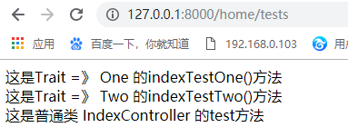


2. Trait的优先级问题
  2.1. trait优先级大于基类
  2.2. 本类的优先级大于trait
  
  注意：**从基类继承的成员会被 trait 插入的成员所覆盖。优先顺序是来自当前类的成员覆盖了 trait 的方法，而 trait 则覆盖了被继承的方法**

```php
<?php

namespace App\Http\Controllers\Home;
use App\Traits\Priority;

class SonController extends Base
{
    use Priority;
    public function index()
    {
        echo '这是当前类sonController的方法 index()';
    }
}
?>


<?php
/**
 * Created by PhpStorm.
 * User: liyi
 * Date: 2018/12/15
 * Time: 17:27
 */
namespace App\Http\Controllers\Home;

class Base
{
    public function index()
    {
        echo '这是Base class 类里的方法 index()';
    }

    public function edit()
    {
        echo '这是Base class 类里的方法 edit()';
    }
}
?>


<?php
/**
 * Created by PhpStorm.
 * User: liyi
 * Date: 2018/12/15
 * Time: 17:24
 */
namespace App\Traits;

trait Priority
{
    public function index()
    {
        echo '这是Priority trait 里的index() 方法';
    }
    
    public function edit()
    {
        //parent::edit();
        echo '这是Priority trait 里的edit() 方法';
    }

}
?>
```
输出如图所示：当前类的优先级最高，所以输出的是当前类的方法

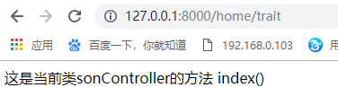


现在我们`(new HomeController)->edit()`这个方法输出： 输出的是我们trait里的方法，说明我们trait优先级大于基类

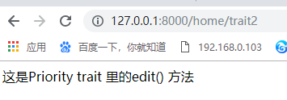

如果我们把trait里的edit()方法修改一下
```php
<?php
/**
 * Created by PhpStorm.
 * User: liyi
 * Date: 2018/12/15
 * Time: 17:24
 */
namespace App\Traits;

trait Priority
{
    public function index()
    {
        echo '这是Priority trait 里的index() 方法';
    }

    public function edit()
    {
        parent::edit();
        echo '这是Priority trait 里的edit() 方法';
    }
}
?>
```

这次再`(new SonController)->edit()`,得到的输出就是trait里的edit()方法和基类Base里的edit()方法，如下：

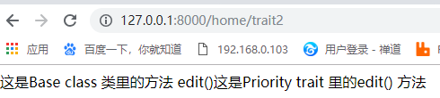


3. **Trait之间的冲突解决方法**

冲突其实在我们的代码中其实是很常见的，尤其我们在给我们的方法【函数】命名的时候，绞尽脑汁的想呀想。是个非常方的事情

在trait中也是如此，比如我们有两个trait，两个中都有store方法和save方法，这个时候如果我们在同一个类中，同时引入了它们两个
就好像下面这样：

```php
<?php
/**
 * Created by PhpStorm.
 * User: liyi
 * Date: 2018/12/13
 * Time: 16:03
 */
namespace App\Traits;

trait Three
{
    public function save()
    {
        echo '这是Three里的save()方法';
    }

    public function store()
    {
        echo '这是Three里的store()方法';
    }
}
?>

<?php
/**
 * Created by PhpStorm.
 * User: liyi
 * Date: 2018/12/15
 * Time: 18:01
 */
namespace App\Traits;

trait Four
{
    public function save()
    {
        echo '这是Fore里的save()方法';
    }

    public function store()
    {
        echo '这是Fore里的store()方法';
    }
}
?>

<?php

namespace App\Http\Controllers\Home;

use App\Traits\Three;
use App\Traits\Four;

class FivesController
{
    use Three,Four;
}
?>
```

如果像我们这样直接引入，然后直接调用方法：
```php
(new FivesController())->save();
echo "<br />";
(new FivesController())->store();
```

那么我们最后得到的结果就是如下：
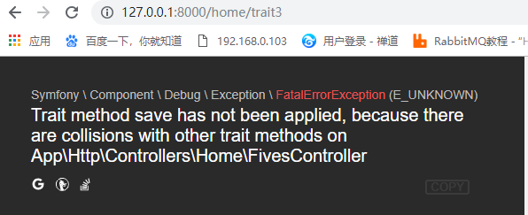

所以我们需要在引入的时候指定我们需要用哪个trait里的那个方法。**为了解决多个 trait 在同一个类中的命名冲突，需要使用 insteadof 操作符来明确指定使用冲突方法中的哪一个。**
```php
<?php

namespace App\Http\Controllers\Home;

use App\Traits\Three;
use App\Traits\Four;

class FivesController
{
    use Three,Four{
        Three::save insteadof Four;
        Four::store insteadof Three;
    }
}
?>
```
之后我们再做同样的调用的时候，它就知道我们调用的save()方法是Three里的，而调用store()方法是Four的.如下：
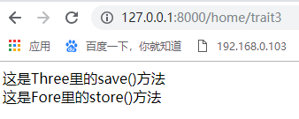

在调用的时候【insteadof】关键字好像就是告诉你它前面的代替它后面的


以上方式仅允许排除掉其它方法，as 操作符可以 为某个方法引入别名。 注意，as 操作符不会对方法进行重命名，也不会影响其方法。
像上面就是我们只得其一，这样我们还不满意，就是想鱼和熊掌兼得的话，我们就可以使用as关键字
像下面这样：
```php
<?php

namespace App\Http\Controllers\Home;

use App\Traits\Three;
use App\Traits\Four;

class SixController
{
    use Three,Four{
        Three::save insteadof Four;//Three::save里的方法代替Four里的save方法输出
        Four::save as save1;//Four里的方法起别名输出
        Four::store insteadof Three;
        Three::store as store1;
    }
}
?>
```

最后得到的效果图如下：
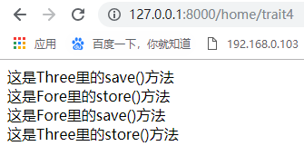

我们先使用关键字【insteadof】对方法进行代替，然后用关键字【as】对被代替的方法起别名，然后调用输出
```php
(new SixController())->save();
echo "<br />";
(new SixController())->store();
echo "<br />";
(new SixController())->save1();
echo "<br />";
(new SixController())->store1();
```

我们使用关键字【as】还可以修改这个方法的访问控制权，虽然改变了方法的访问的权限，但是它对方法本身的权限并没有改变，改变的只是
当前类调用的时候的权限，话不多说，如下：
```php
<?php
/**
 * Created by PhpStorm.
 * User: liyi
 * Date: 2018/12/16
 * Time: 14:47
 */
namespace App\Traits;

trait Seven
{
    public function sayHello()
    {
        echo '我是trait Seven 里的public方法sayHello()方法！';
    }
}
?>

<?php

namespace App\Http\Controllers\Home;

use App\Traits\Seven;

class EightController
{
    use Seven{
        sayHello as protected;
    }
}
?>

<?php

namespace App\Http\Controllers\Home;

use App\Traits\Seven;

class NineController
{
    use Seven{
        sayHello as private;
    }
}
?>
```
现在我们去调用这两个控制器
```php
(new EightController())->sayHello();
(new NineController()->sayHello();
```
得到的结果很明显，是报错了：
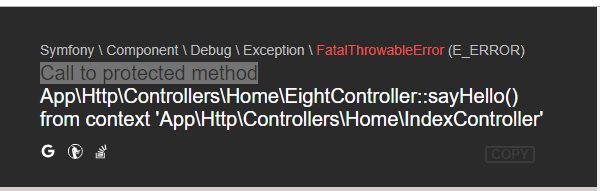
在类的外面，我们是不能调用受保护或者是私有的方法的，下面我们在类的内部试一试，看看结果如何：
```php
<?php

namespace App\Http\Controllers\Home;

use App\Traits\Seven;

class EightController
{
    use Seven{
        sayHello as protected;
    }

    public function sayWorld()
    {
        $this->sayHello();
    }
}
?>

<?php

namespace App\Http\Controllers\Home;

use App\Traits\Seven;

class NineController
{
    use Seven{
        sayHello as private;
    }

    public function sayWorld()
    {
        $this->sayHello();
    }
}
?>

```
这个时候我们再去代用类里的方法，就没问题了，不过一般我们不会这么做的，我觉得。
调用：
```php
(new EightController())->sayWorld();
(new EightController())->sayWorld();
```
得到的结果：


我们不仅可以把它的权限由public 改为 protected 或者 private；也可以把它的权限由private或者protected改为public
这样就可以让我们访问了。

4. **trait 和trait之间也是可以相互调用，相互组合的**
```php
<?php
/**
 * Created by PhpStorm.
 * User: liyi
 * Date: 2018/12/16
 * Time: 16:07
 */
namespace App\Traits;

trait Ten
{
    public function sayHello()
    {
        echo '我是Ten，我说：Hello';
        echo "<br />";
    }
}
?>
<?php
/**
 * Created by PhpStorm.
 * User: liyi
 * Date: 2018/12/16
 * Time: 16:09
 */
namespace App\Traits;

trait Eleven
{
    public function sayWorld()
    {
        echo '我是Eleven，我说：World';
    }
}
?>

<?php
/**
 * Created by PhpStorm.
 * User: liyi
 * Date: 2018/12/16
 * Time: 16:11
 */
namespace App\Traits;

use App\Traits\Ten;
use App\Traits\Eleven;

trait Twelve
{
    use Ten,Eleven;
}
?>

<?php

namespace App\Http\Controllers\Home;
use App\Traits\Twelve;

class ThirteenController
{
    use Twelve;
}
?>

```
我们有三个trait，分别是Ten里的sayHello()方法以及Eleven里的sayWorld()方法
然后由第三个trait Twelve引入它们两个，最后有类ThirteenController引入Twelve。调用如下：
```php
(new ThirteenController())->sayHello();
(new ThirteenController())->sayWorld();
```
输出如下：
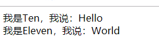

5. **trait 的抽象成员**
在trait里我们也是可以抽象成员方法的
```php
<?php
/**
 * Created by PhpStorm.
 * User: liyi
 * Date: 2018/12/16
 * Time: 16:26
 */
namespace App\Traits;

trait Fourteen
{
    public function getValue()
    {
        echo '**'."<br />";
        echo '这个trait  Fourteen里面的抽象方法setValue():'.$this->setValue();
    }

    abstract public function setValue();
}
?>

<?php

namespace App\Http\Controllers\Home;

use App\Traits\Fourteen;

class FifteenController
{
    use Fourteen;

    protected $name = '小李子';

    public function setValue()
    {
        // TODO: Implement setValue() method.
       return $this->name;
    }
}
?>

```
我们在FifteenController里面把【trait】Fourteen里的抽象方法实现：
然后调用：
```php
(new FifteenController())->getValue();
```
得到输出：
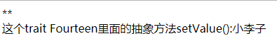

6. **在trait里定义静态成员以及静态方法和属性**
这个就和我们普通类里面定义的一样，我感觉没有区别
如下：
```php
<?php
/**
 * Created by PhpStorm.
 * User: liyi
 * Date: 2018/12/16
 * Time: 16:51
 */
namespace App\Traits;

trait Statics
{
    public function inc()
    {
        static $day = 0;
        $day++;
        echo $day;
    }

    public static function getStaticValue()
    {
        $time = time();
        echo '现在是' . date('Y',$time) . '年' . "<br />";
        echo '现在是' . date('m',$time) . '月' . "<br />";
        echo '现在是' . date('d',$time) . '日' . "<br />";
        echo '现在是' . date('H',$time) . '时' . "<br />";
        echo '现在是' . date('i',$time) . '分' . "<br />";
        echo '现在是' . date('s',$time) . '秒' . "<br />";
    }
}
?>

<?php

namespace App\Http\Controllers\Home;

use App\Traits\Statics;

class Static1Controller
{
    use Statics;
}
?>

<?php

namespace App\Http\Controllers\Home;

use App\Traits\Statics;

class Static2Controller
{
    use Statics;
}
?>

```
最后我们在调用：
```php
(new Static1Controller())->inc();
echo "<br />";
(new Static2Controller())->inc();
```
输出如下：


符合我们在普通类里调用静态变量一切的样子

下面是我们调用它的静态函数：
```php
Static1Controller::getStaticValue();
Static2Controller::getStaticValue();
```
输出如下：


定义属性的时候要注意，在trait里面定义的属性要和class里面定义的属性最好不要相同，不然会产生冲突
```php
<?php
/**
 * Created by PhpStorm.
 * User: liyi
 * Date: 2018/12/16
 * Time: 17:18
 */
namespace App\Traits;

trait Attributes
{
    public $name = '小li子';
}
?>

<?php

namespace App\Http\Controllers\Home;

use App\Traits\Attributes;

class AttributesController
{
    use Attributes;
}
?>

```
调用：
```php
print (new AttributesController())->name;
```

输出：


下面是产生冲突的样子，我们只需要修改：
```php
<?php

namespace App\Http\Controllers\Home;

use App\Traits\Attributes;

class AttributesController
{
    use Attributes;

    public $name = 'xiaolizi';
}

```
同样的调用：`print (new AttributesController())->name;`

最后的输出却是：
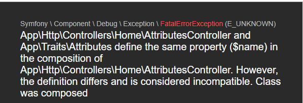

> 注意：Trait 定义了一个属性后，类就不能定义同样名称的属性，否则会产生 fatal error。 有种情况例外：属性是兼容的（同样的访问可见度、初始默认值）。 在 PHP 7.0 之前，属性是兼容的，则会有 E_STRICT 的提醒。

不过我觉得还是尽量避免这样的同样的命名吧。