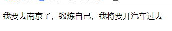

### 依赖（二） 
接着上一讲的依赖这个话题
- 控制反转是将组件间的依赖关系从程序内部提到外部容器来管理
- 依赖注入是指组件的依赖通过外部参数或其它形式注入

我们如果将上一讲的依赖放到简单工厂模式来实现
```php
<?php

namespace App\Http\Controllers\Test;

use App\Http\Controllers\Test\VehicleInterface;

class WalkController implements VehicleInterface
{
    protected $_run;
    protected $_target;

    public function __construct($run,$target)
    {
        $this->_run = $run;
        $this->_target = $target;
    }

    public function goRun()
    {
        // TODO: Implement goRun() method.
        return $this->_run;

    }

    public function goToTarget()
    {
        // TODO: Implement goToTarget() method.
        echo '我要去'.$this->goRun().'了，锻炼自己，我将要'.$this->_target.'过去';
    }
}
?>

<?php

namespace App\Http\Controllers\Test;

use App\Http\Controllers\Test\VehicleInterface;

class CarController implements VehicleInterface
{
    protected $_run;
    protected $_target;

    public function __construct($run,$target)
    {
        $this->_run = $run;
        $this->_target = $target;
    }

    public function goRun()
    {
        // TODO: Implement goRun() method.
        return $this->_run;

    }

    public function goToTarget()
    {
        // TODO: Implement goToTarget() method.
        echo '我要去'.$this->goRun().'了，锻炼自己，我将要'.$this->_target.'过去';
    }
}
?>

<?php

namespace App\Http\Controllers\Test;

use App\Http\Controllers\Test\VehicleInterface;

class TrainController implements VehicleInterface
{
    protected $_run;
    protected $_target;

    public function __construct($run,$target)
    {
        $this->_run = $run;
        $this->_target = $target;
    }

    public function goRun()
    {
        // TODO: Implement goRun() method.
        return $this->_run;

    }

    public function goToTarget()
    {
        // TODO: Implement goToTarget() method.
        echo '我要去'.$this->goRun().'了，锻炼自己，我将要'.$this->_target.'过去';
    }
}
?>

<?php

namespace App\Http\Controllers\Test;

use App\Http\Controllers\Test\VehicleInterface;

class AircraftController implements VehicleInterface
{
    protected $_run;
    protected $_target;

    public function __construct($run,$target)
    {
        $this->_run = $run;
        $this->_target = $target;
    }

    public function goRun()
    {
        // TODO: Implement goRun() method.
        return $this->_run;

    }

    public function goToTarget()
    {
        // TODO: Implement goToTarget() method.
        echo '我要去'.$this->goRun().'了，锻炼自己，我将要'.$this->_target.'过去';
    }
}
?>
```
我们来创造一个工厂，把我们需要用到的类都放到工厂里加工一下
```php
<?php

namespace App\Http\Controllers\Test;

use App\Http\Controllers\Test\WalkController;
use App\Http\Controllers\Test\CarController;
use App\Http\Controllers\Test\TrainController;
use App\Http\Controllers\Test\AircraftController;

class FactoryController
{
    protected $_type;
    protected $_run;
    protected $_target;

    public function __construct($type,$run,$target)
    {
        $this->_type = $type;
        $this->_run = $run;
        $this->_target = $target;
    }

    public function choice()
    {
        switch ($this->_type)
        {
            case 'WalkController':
                $example = new WalkController($this->_run,$this->_target);
                break;
            case 'CarController':
                $example = new CarController($this->_run,$this->_target);
                break;
            case 'TrainController':
                $example = new TrainController($this->_run,$this->_target);
                break;
            case 'AircraftController':
                $example = new AircraftController($this->_run,$this->_target);
                break;
            default:
                $example = false;
                break;
        }
        return $example;
    }
}

?>
```

然后我们再调用的时候就变了,变成这样了：
```php
<?php

namespace App\Http\Controllers\Test;


class TravelController
{
    public $obj;
    /*public function __construct()
    {
        $this->obj = new CarController('北京','开汽车');
    }*/

    public function __construct()
    {
        $this->obj = (new FactoryController('CarController','南京','开汽车'))->choice();
    }

    public function go()
    {
        $this->obj->goToTarget();
    }
}
?>

//调用
(new TravelController())->go();

```
最后一样可以输出：


在这里我们可以看到，我们的旅游类和交通工具之间的依赖没有了，但是又添加了旅游类与交通工具的交通工厂类之间的依赖。
当我们的工厂工作量还是很小的时候还好，当工厂的工作量十分庞大的时候，就会很臃肿，很麻烦的
所以我们还有没有办法解决呢？答案还是有的，那就是我们的【依赖注入模式】


