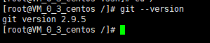
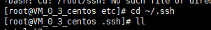
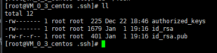
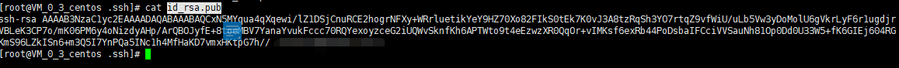
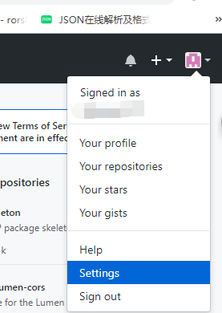
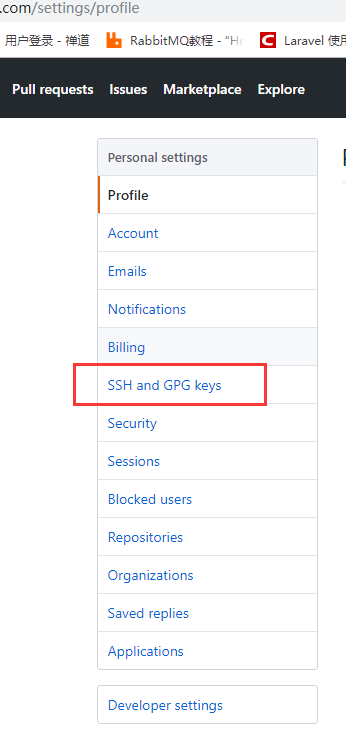
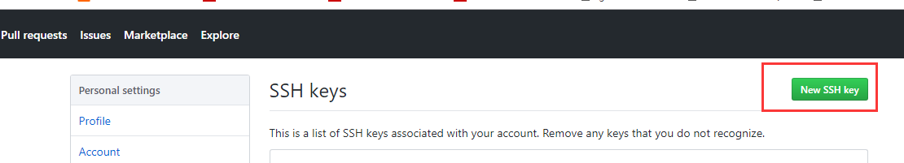
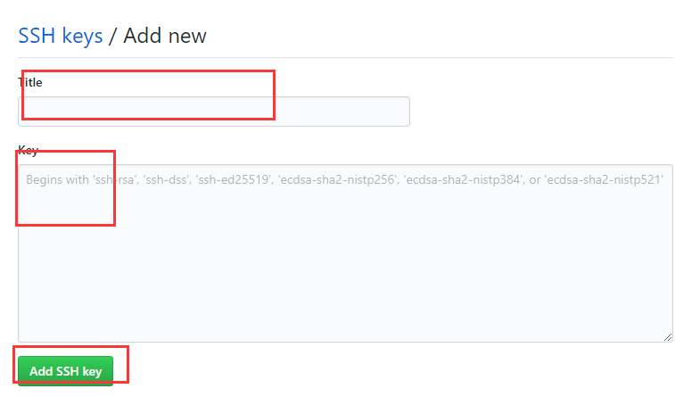

### centos7.* 安装git2.*

一般我们安装的centos系统，如果我们直接yum安装git的话，它的默认版本是1.7*，而我们如果需要使用到github的话，它最低要求就是1.8*的
所以，这里我们不推荐使用`yum install git`这种安装方式

**下面是编译安装：**

- 卸载旧的git版本

```php
yum remove git
```

- 下载git的包

```php
wget https://mirrors.edge.kernel.org/pub/software/scm/git/git-2.9.5.tar.gz
```

- 解压包

```php
tar zxvf git-2.9.5.tar.gz
```

- 进入git包里

```php
cd git-2.9.5
```

- 设置git的安装位置

```php
mkdir /usr/local/git-2.9.5
```

- 编译安装

```php
./configure --prefix=/usr/local/git-2.9.5

//这一步可能会提示我们缺少一些依赖，直接yum install ['依赖名即可']
//依赖  curl-devel expat-devel gettext-devel openssl-devel zlib-devel gcc perl-ExtUtils-MakeMaker
//可能不止这些，也可能没有这么多，只要你已经安装过了，就不需要重复安装
//【curl-devel expat-devel gettext-devel openssl-devel zlib-devel】

make && make install
```

- 把git添加到全局变量里面去

```php
GIT_HOME = /usr/local/git-2.9.5
export PATH=$GIT_HOME/bin:$PATH
```

- 让配置生效

```php
source /etc/profile
```

- 查兰git版本

```php
git --version
```



[git官方安装教程](https://git-scm.com/book/zh/v1/%E8%B5%B7%E6%AD%A5-%E5%AE%89%E8%A3%85-Git)

- 绑定github用户名，邮箱

```php
git config --global user.name "liyi"

git config --global user.email "123@hotmail.com"
```

- 查看账户和邮箱

```php
git config user.name

git config user.email
```

- 创建github公钥

```php
//查看是否有秘钥
cd ~/.ssh // 【图一】

//ll查看
ll

//没有创建
ssh-keygen -t rsa -C "123@hotmail.com"//这里的邮箱就是上面设置的邮箱

//根据要求三次回车之后可以看到秘钥的位置
```





- 登录自己的github账户，把秘钥添加进去

1. 复制出刚刚创建的秘钥`cat id_rsa.pub`



2.点击如图所示的`settings`



3.点击`ssh and gpg keys`



4.点击`new ssh key`



5.进入之后可以看到`title`

`title` 随便写

`key` 就是你在服务器上生成刚才查看复制出来的，现在粘贴进去

完成之后点击 `add ssh key`。设置完毕




**如上git安装成功**

-----

沧海一粟，越是渺小，才要燃烧出崔璨的花火，你我都是如此，加油！

