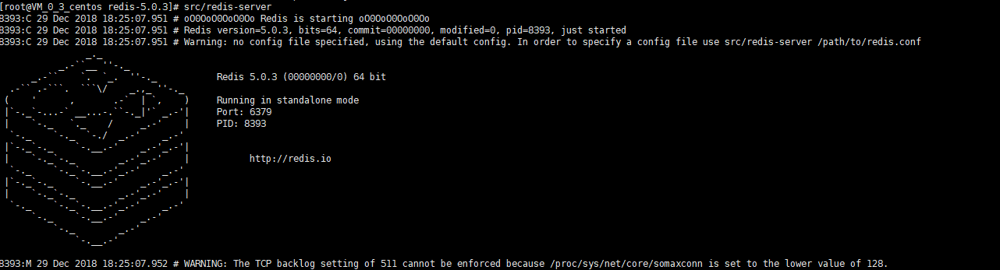
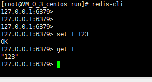
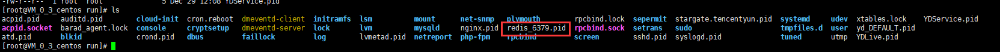

### liunx-centos上redis的安装测试

- 下载redis
[redis官方网站下载地址](https://redis.io/download)

- 在centos上编译安装
    
  1. 下载 `wget http://download.redis.io/releases/redis-5.0.3.tar.gz`
  2. 解压 `tar xzf redis-5.0.3.tar.gz`
  3. 进入redis目录 `cd redis-5.0.3`
  4. 编译 `make`
  5. 安装 `make install`
  
- 安装完成之后测试`redis`是否可以启动

   1. `cd src` 然后输入启动命令 `redis-server`
   
   成功如下：
   
   
   
   2. 
   
   3. 重新打开一个终端，这个终端不要关，然后用绝对路径输入命令 `/home/redis-5.0.3/src/redis-cli`;【这个路径是看你们在那个位置安装的，不要和我的一样】
   
   接下来可以看到：
   
   
   
现在我们的redis已经安装成功了，不过缺点是，前面的我们那个终端不能关，要一直打开，这可不行，所以我们要让它开机自启，以及给它配备一些我们容易记住的命令【启动，停止】

- 进入我们的redis的安装目录，`cd /home/redis-5.0.3/utils` 可以看到`redis_init_script`它，对就是它，它就是官方已经为我们准备好的启动，停止脚本。
  
  1. 复制它到我们的centos最牛逼的进程文件下。 `cp redis_init_script /etc/init.d`
  
  2. 在 `/etc/init.d/` 下修改`redis_init_script` 为 `redis` => `mv redis_init_script redis`
  
  3. 给它执行的权限 `chmod +x redis`
  
  4. 移动`cd /home/redis-5.0.3/`,可以看到`redis.conf`文件，复制它到`etc/redis/`。命令`cp redis.conf /etc`
    `cd /etc` 创建文件`mkdir redis`,移动文件`mv redis.conf redis/6379.conf`
  
  5. 查看 `cd /run` 文件下，查看有没有`redis_***.pid`的文件，如果没有，我们尝试运行`/etc/redis/6379.conf`
    再次查看就可以看到，如下所示：
    
    
    
  6. `/etc/init.d/redis`脚本参数介绍
       
    ```php
    //REDISPORT=6379 redis 端口号
    
    //EXEC=/usr/local/bin/redis-server redis-server 所在路径
    
    //CLIEXEC=/usr/local/bin/redis-cli redis-cli 所在路径
    
    //PIDFILE=/var/run/redis_${REDISPORT}.pid redis_**.pid 所在路径
    
    //CONF="/etc/redis/${REDISPORT}.conf" redis/***.conf 所在的路径
    ```  

   7. 创建redis 的日志与data文件
    ```php
    mkdir -p /var/bin/redis
    
    mkdir -p /var/log/redis
    ```   
   
   8. 修改`redis`的配置文件，`vi /etc/redis/6379.conf`,搜索`/daemonize`,把`daemonize no`修改为`daemonize yes`,保存退出
   
   9. 添加到开机自启动`chkconfig redis on`
   
   10. 测试开启命令
    
   `service redis start`
   
   11. 测试关闭命令
   
   `service redis stop`
   
   12. 全局直接启动
   
   `redis-cli`
   
   
   
---------

大雪纷飞！  
  